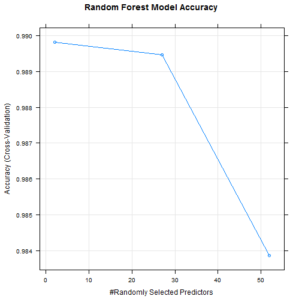
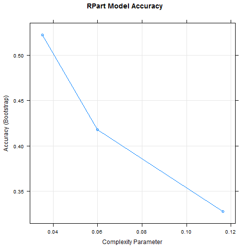

###Practical Machine Learning Research Project
* author: Megan Minshew
* date: August 21, 2014
* output: PML_Exercise_Study.Rmd
* html_document:PML_Exercise_Study.html


###Study Summary
This study attempts to classify the manner in which a person exercises, based on data collected by quantified self movement devices, such as Jawbone Up, Nike FuelBand and Fitbit. The study participants were instructed to perform a series of exercises five different ways with only one way being the correct way. Data provided by the study classifies the exercise in the following categories: A-exactly according to specification, B-throwing elbows to the front, C-lifting the dumbbell halfway, D-lowering the dumbbell halfway, and E-throwing hips to the front.

The purpose of this study is to develop the means to improve exercise by incorporating a feedback mechanism into the tracking device, warning a person if they are exercising in a less than optimal manner. Assessing the correctness of the categorization of exercise is required before the feasability of the product can be measured. 

Data for this study is provided by and available at:
http://groupware.les.inf.puc-rio.br/har


```r
#using libraries:
library(kernlab); library(psych); library(rattle); library(rpart); library(caret); library(randomForest)
```

###Exploratory Analysis
Exercise measurement data is loaded and split into 60% training and 40% model testing. Analysis of the 160 data elements available indicate a number of variables to be excluded because they are sparsely populated, contain no variation in the data or were not measures of movement. This study assumes that subject and time specific indicators should be ignored.


```r
#load the activity data
data <- read.csv("pml-training.csv") #training data provided by the study

inTrain <- createDataPartition(y=data$classe,p=0.60, list=FALSE)
training <- data[inTrain,]
testing <- data[-inTrain,]

#Survey the data to identify useful elements
d <- describe(training)
d[8:20,2:8]
```

```
##                           n   mean    sd median trimmed    mad    min
## roll_belt             11776  64.00 62.76 112.00   62.92  65.23  -28.8
## pitch_belt            11776   0.24 22.33   5.24    2.34   9.56  -54.9
## yaw_belt              11776 -11.31 95.31 -14.25  -23.34 109.34 -179.0
## total_accel_belt      11776  11.27  7.73  17.00   11.07  11.86    0.0
## kurtosis_roll_belt*   11776   5.26 33.76   1.00    1.00   0.00    1.0
## kurtosis_picth_belt*  11776   4.57 27.38   1.00    1.00   0.00    1.0
## kurtosis_yaw_belt*    11776   1.02  0.14   1.00    1.00   0.00    1.0
## skewness_roll_belt*   11776   5.13 32.74   1.00    1.00   0.00    1.0
## skewness_roll_belt.1* 11776   4.42 26.80   1.00    1.00   0.00    1.0
## skewness_yaw_belt*    11776   1.02  0.14   1.00    1.00   0.00    1.0
## max_roll_belt           247  -4.93 95.03  -4.60  -15.33 123.35  -94.3
## max_picth_belt          247  12.89  7.96  18.00   12.60  11.86    3.0
## max_yaw_belt*         11776   1.37  3.28   1.00    1.00   0.00    1.0
```

```r
#Remove the attributes that aren't fully populated
d <- d[d$n==max(d$n),]
#d$mad has a number of attributes with zero variance, remove those
d <- d[d$mad!=0,]
#remove the counters, participant and time attributes
d <- d[7:59,]
#subset the training data to the columns with significant data
t <- training[,d$vars]
```
###Machine Learning Evaluations
The classification of the quality of exercise is based on 52 measures of movement in one or more components of 3-D space. Linear modeling and generalized linear modeling have been eliminated as the data will not comform to the algorithm design.

Decision Trees, Bagging and Random Forests are appropriate algorithms for handling the study data and will be evaluated and compared.

Measurement can be roughly sorted into one of four categories: belt, arm, dumbell and forearm. Each category contains 13 different measures. To limit the processing time, cross-validation passes will be a third of the number of measures per category or 5 for algorithms that use cross-validation.


```r
#Set the cvLimit value
cvLimit = trainControl(method="cv", number = 5)
```

###Decision Trees or Recursive Partitioning method

```r
#get a test and train set for decision trees
r_t <- t
r_testing <- testing
r_model <- train(classe ~ ., method="rpart", data = r_t)
#Show the trees
fancyRpartPlot(r_model$finalModel)
```

 

```r
#Summarize the model
r_model$finalModel
```

```
## n= 11776 
## 
## node), split, n, loss, yval, (yprob)
##       * denotes terminal node
## 
##  1) root 11776 8428 A (0.28 0.19 0.17 0.16 0.18)  
##    2) roll_belt< 129.5 10721 7410 A (0.31 0.21 0.19 0.18 0.11)  
##      4) pitch_forearm< -34.15 942    7 A (0.99 0.0074 0 0 0) *
##      5) pitch_forearm>=-34.15 9779 7403 A (0.24 0.23 0.21 0.2 0.12)  
##       10) magnet_dumbbell_y< 439.5 8262 5934 A (0.28 0.18 0.24 0.19 0.1)  
##         20) roll_forearm< 123.5 5122 3048 A (0.4 0.18 0.19 0.17 0.057) *
##         21) roll_forearm>=123.5 3140 2107 C (0.081 0.18 0.33 0.23 0.18) *
##       11) magnet_dumbbell_y>=439.5 1517  736 B (0.032 0.51 0.042 0.23 0.19) *
##    3) roll_belt>=129.5 1055   37 E (0.035 0 0 0 0.96) *
```

```r
#Predict the testing data from the training data model
r_predicted <- predict(r_model, newdata=r_testing[,-1])
#Display the results
table(r_predicted, r_testing$classe)
```

```
##            
## r_predicted    A    B    C    D    E
##           A 2008  655  629  570  198
##           B   33  505   45  226  183
##           C  154  358  694  490  380
##           D    0    0    0    0    0
##           E   37    0    0    0  681
```

```r
#How accurate is the prediction
confusionMatrix(r_predicted,r_testing$classe)
```

```
## Confusion Matrix and Statistics
## 
##           Reference
## Prediction    A    B    C    D    E
##          A 2008  655  629  570  198
##          B   33  505   45  226  183
##          C  154  358  694  490  380
##          D    0    0    0    0    0
##          E   37    0    0    0  681
## 
## Overall Statistics
##                                         
##                Accuracy : 0.496         
##                  95% CI : (0.484, 0.507)
##     No Information Rate : 0.284         
##     P-Value [Acc > NIR] : <2e-16        
##                                         
##                   Kappa : 0.341         
##  Mcnemar's Test P-Value : NA            
## 
## Statistics by Class:
## 
##                      Class: A Class: B Class: C Class: D Class: E
## Sensitivity             0.900   0.3327   0.5073    0.000   0.4723
## Specificity             0.634   0.9230   0.7867    1.000   0.9942
## Pos Pred Value          0.495   0.5091   0.3343      NaN   0.9485
## Neg Pred Value          0.941   0.8522   0.8832    0.836   0.8932
## Prevalence              0.284   0.1935   0.1744    0.164   0.1838
## Detection Rate          0.256   0.0644   0.0885    0.000   0.0868
## Detection Prevalence    0.517   0.1264   0.2646    0.000   0.0915
## Balanced Accuracy       0.767   0.6279   0.6470    0.500   0.7332
```

###Boosting

```r
#get a test and train set for bagging
b_t <- t
b_testing <- testing
b_model <- train(classe ~ ., method="gbm", trControl=cvLimit, data=b_t, verbose=FALSE)
#Summarize the model
summary(b_model)
```

 

```
##                                       var  rel.inf
## roll_belt                       roll_belt 22.44297
## pitch_forearm               pitch_forearm 10.73621
## yaw_belt                         yaw_belt  8.47054
## magnet_dumbbell_z       magnet_dumbbell_z  6.38021
## magnet_dumbbell_y       magnet_dumbbell_y  5.35129
## roll_forearm                 roll_forearm  5.30109
## magnet_belt_z               magnet_belt_z  4.96973
## pitch_belt                     pitch_belt  3.62969
## gyros_belt_z                 gyros_belt_z  3.17066
## accel_dumbbell_y         accel_dumbbell_y  3.09984
## roll_dumbbell               roll_dumbbell  2.51620
## magnet_dumbbell_x       magnet_dumbbell_x  2.41657
## accel_forearm_x           accel_forearm_x  2.29612
## magnet_forearm_z         magnet_forearm_z  2.19006
## gyros_dumbbell_y         gyros_dumbbell_y  1.89562
## yaw_arm                           yaw_arm  1.73809
## accel_dumbbell_x         accel_dumbbell_x  1.39066
## magnet_arm_z                 magnet_arm_z  1.26525
## accel_dumbbell_z         accel_dumbbell_z  1.01372
## magnet_belt_x               magnet_belt_x  0.96460
## magnet_belt_y               magnet_belt_y  0.92183
## magnet_forearm_x         magnet_forearm_x  0.89575
## accel_forearm_z           accel_forearm_z  0.73228
## accel_belt_z                 accel_belt_z  0.66371
## roll_arm                         roll_arm  0.64386
## magnet_arm_x                 magnet_arm_x  0.60476
## total_accel_dumbbell total_accel_dumbbell  0.47923
## total_accel_forearm   total_accel_forearm  0.46314
## gyros_arm_y                   gyros_arm_y  0.45084
## gyros_belt_y                 gyros_belt_y  0.44129
## magnet_arm_y                 magnet_arm_y  0.32103
## magnet_forearm_y         magnet_forearm_y  0.30829
## gyros_dumbbell_x         gyros_dumbbell_x  0.28812
## yaw_forearm                   yaw_forearm  0.24096
## gyros_dumbbell_z         gyros_dumbbell_z  0.21334
## accel_forearm_y           accel_forearm_y  0.20903
## gyros_forearm_z           gyros_forearm_z  0.19121
## pitch_dumbbell             pitch_dumbbell  0.19061
## accel_arm_x                   accel_arm_x  0.18152
## yaw_dumbbell                 yaw_dumbbell  0.12912
## accel_arm_y                   accel_arm_y  0.08231
## gyros_arm_x                   gyros_arm_x  0.05683
## accel_arm_z                   accel_arm_z  0.05181
## total_accel_belt         total_accel_belt  0.00000
## gyros_belt_x                 gyros_belt_x  0.00000
## accel_belt_x                 accel_belt_x  0.00000
## accel_belt_y                 accel_belt_y  0.00000
## pitch_arm                       pitch_arm  0.00000
## total_accel_arm           total_accel_arm  0.00000
## gyros_arm_z                   gyros_arm_z  0.00000
## gyros_forearm_x           gyros_forearm_x  0.00000
## gyros_forearm_y           gyros_forearm_y  0.00000
```

```r
#Predict the testing data from the training data model
b_predicted <- predict(b_model, newdata=b_testing[,-1])
#Display the results
table(b_predicted, b_testing$classe)
```

```
##            
## b_predicted    A    B    C    D    E
##           A 2206   57    0    1    3
##           B   17 1407   26    5   20
##           C    7   51 1323   53   15
##           D    2    1   18 1221   17
##           E    0    2    1    6 1387
```

```r
#How accurate is the prediction
confusionMatrix(b_predicted, b_testing$classe)
```

```
## Confusion Matrix and Statistics
## 
##           Reference
## Prediction    A    B    C    D    E
##          A 2206   57    0    1    3
##          B   17 1407   26    5   20
##          C    7   51 1323   53   15
##          D    2    1   18 1221   17
##          E    0    2    1    6 1387
## 
## Overall Statistics
##                                         
##                Accuracy : 0.962         
##                  95% CI : (0.957, 0.966)
##     No Information Rate : 0.284         
##     P-Value [Acc > NIR] : < 2e-16       
##                                         
##                   Kappa : 0.951         
##  Mcnemar's Test P-Value : 1.93e-15      
## 
## Statistics by Class:
## 
##                      Class: A Class: B Class: C Class: D Class: E
## Sensitivity             0.988    0.927    0.967    0.949    0.962
## Specificity             0.989    0.989    0.981    0.994    0.999
## Pos Pred Value          0.973    0.954    0.913    0.970    0.994
## Neg Pred Value          0.995    0.983    0.993    0.990    0.991
## Prevalence              0.284    0.193    0.174    0.164    0.184
## Detection Rate          0.281    0.179    0.169    0.156    0.177
## Detection Prevalence    0.289    0.188    0.185    0.160    0.178
## Balanced Accuracy       0.989    0.958    0.974    0.972    0.980
```

###Random Forests

```r
#get a test and train set for Decision Trees
rf_t <- t
rf_testing <- testing
rf_model <- train(classe ~ ., method="rf", trControl=cvLimit, data=rf_t, prox=TRUE)
#Summarize the model
summary(rf_model)
```

```
##                 Length    Class      Mode     
## call                    5 -none-     call     
## type                    1 -none-     character
## predicted           11776 factor     numeric  
## err.rate             3000 -none-     numeric  
## confusion              30 -none-     numeric  
## votes               58880 matrix     numeric  
## oob.times           11776 -none-     numeric  
## classes                 5 -none-     character
## importance             52 -none-     numeric  
## importanceSD            0 -none-     NULL     
## localImportance         0 -none-     NULL     
## proximity       138674176 -none-     numeric  
## ntree                   1 -none-     numeric  
## mtry                    1 -none-     numeric  
## forest                 14 -none-     list     
## y                   11776 factor     numeric  
## test                    0 -none-     NULL     
## inbag                   0 -none-     NULL     
## xNames                 52 -none-     character
## problemType             1 -none-     character
## tuneValue               1 data.frame list     
## obsLevels               5 -none-     character
```

```r
#Predict the testing data from the training data model
rf_predicted <- predict(rf_model, newdata=rf_testing[,-1])
#Display the results
table(rf_predicted, rf_testing$classe)
```

```
##             
## rf_predicted    A    B    C    D    E
##            A 2230   15    0    0    0
##            B    2 1501    6    0    0
##            C    0    2 1355   29    3
##            D    0    0    7 1256    1
##            E    0    0    0    1 1438
```

```r
#How accurate is the prediction
confusionMatrix(rf_predicted, rf_testing$classe)
```

```
## Confusion Matrix and Statistics
## 
##           Reference
## Prediction    A    B    C    D    E
##          A 2230   15    0    0    0
##          B    2 1501    6    0    0
##          C    0    2 1355   29    3
##          D    0    0    7 1256    1
##          E    0    0    0    1 1438
## 
## Overall Statistics
##                                         
##                Accuracy : 0.992         
##                  95% CI : (0.989, 0.993)
##     No Information Rate : 0.284         
##     P-Value [Acc > NIR] : <2e-16        
##                                         
##                   Kappa : 0.989         
##  Mcnemar's Test P-Value : NA            
## 
## Statistics by Class:
## 
##                      Class: A Class: B Class: C Class: D Class: E
## Sensitivity             0.999    0.989    0.990    0.977    0.997
## Specificity             0.997    0.999    0.995    0.999    1.000
## Pos Pred Value          0.993    0.995    0.976    0.994    0.999
## Neg Pred Value          1.000    0.997    0.998    0.995    0.999
## Prevalence              0.284    0.193    0.174    0.164    0.184
## Detection Rate          0.284    0.191    0.173    0.160    0.183
## Detection Prevalence    0.286    0.192    0.177    0.161    0.183
## Balanced Accuracy       0.998    0.994    0.993    0.988    0.999
```

###Study Findings
The 99.9% Balanced accuracy at indentifing Class A or correctly performed exercise obtained by the Random Forest model is slightly better than Boostings 98.9%. Comparing the confusion matrix from all three models supports this choice across all other metrics, particularly with the overall accuracy and the 95% confidence interval for the models predictions. The following Accuracy for cross-validation by model chart supports the choice of the Random Forest model. 


```r
par(mfrow=c(3,1))
plot(rf_model, metric='Accuracy', main="Random Forest Model Accuracy")
```

 

```r
plot(b_model, metric='Accuracy', main="Boosting Model Accuracy")
```

 

```r
plot(r_model, metric='Accuracy', main="RPart Model Accuracy")
```

 
###Cross Validation of Out of Sample Errors and Accuracy
To validate that the model is fairly assessed by the Confusion Matrix, we will repeat the model application to 3 passes of resampling the original data, limiting cross-validation in the model fitting to 2 levels and checking for variance in accuracy or final model selection across the resamples. In the absence of variance, the method will be assumed to be appropriate.


```r
#reset the number of cross-validation iterations to a lower range since this exercise is to cross-validate objectively
cvLimit <- trainControl(method="cv", number = 2)

#pass one of the data
set.seed(1000)
cvTrain <- createDataPartition(y=data$classe,p=0.60, list=FALSE)
cvTraining <- data[cvTrain,]
cvTesting <- data[-cvTrain,]
cvt <- cvTraining[,d$vars]
cv_model_one <- train(classe ~ ., method="rf", trControl=cvLimit, data=cvt, prox=TRUE)
cv_predict_one <- predict(cv_model_one, newdata = cvTesting[-1])
cv_model_one$finalModel
```

```
## 
## Call:
##  randomForest(x = x, y = y, mtry = param$mtry, proximity = TRUE) 
##                Type of random forest: classification
##                      Number of trees: 500
## No. of variables tried at each split: 27
## 
##         OOB estimate of  error rate: 0.79%
## Confusion matrix:
##      A    B    C    D    E class.error
## A 3340    5    2    0    1    0.002389
## B   14 2255    9    1    0    0.010531
## C    0   11 2036    7    0    0.008763
## D    0    1   28 1899    2    0.016062
## E    0    1    6    5 2153    0.005543
```

```r
#pass two of the data
set.seed(2000)
cvTrain <- createDataPartition(y=data$classe,p=0.60, list=FALSE)
cvTraining <- data[cvTrain,]
cvTesting <- data[-cvTrain,]
cvt <- cvTraining[,d$vars]
cv_model_two <- train(classe ~ ., method="rf", trControl=cvLimit, data=cvt, prox=TRUE)
cv_predict_two <- predict(cv_model_two, newdata = cvTesting[-1])
cv_model_two$finalModel
```

```
## 
## Call:
##  randomForest(x = x, y = y, mtry = param$mtry, proximity = TRUE) 
##                Type of random forest: classification
##                      Number of trees: 500
## No. of variables tried at each split: 27
## 
##         OOB estimate of  error rate: 0.82%
## Confusion matrix:
##      A    B    C    D    E class.error
## A 3341    5    2    0    0    0.002091
## B   20 2247   11    1    0    0.014041
## C    0   12 2036    6    0    0.008763
## D    0    2   22 1904    2    0.013472
## E    0    2    3    8 2152    0.006005
```

```r
#pass three of the data
set.seed(3000)
cvTrain <- createDataPartition(y=data$classe,p=0.60, list=FALSE)
cvTraining <- data[cvTrain,]
cvTesting <- data[-cvTrain,]
cvt <- cvTraining[,d$vars]
cv_model_three <- train(classe ~ ., method="rf", trControl=cvLimit, data=cvt, prox=TRUE)
cv_predict_three <- predict(cv_model_three, newdata = cvTesting[-1])
cv_model_three$finalModel
```

```
## 
## Call:
##  randomForest(x = x, y = y, mtry = param$mtry, proximity = TRUE) 
##                Type of random forest: classification
##                      Number of trees: 500
## No. of variables tried at each split: 27
## 
##         OOB estimate of  error rate: 0.72%
## Confusion matrix:
##      A    B    C    D    E class.error
## A 3342    3    1    0    2    0.001792
## B   15 2260    4    0    0    0.008337
## C    0   12 2034    8    0    0.009737
## D    0    1   26 1902    1    0.014508
## E    0    2    4    6 2153    0.005543
```
Additional execution of the chosen model holds up under data variation as the Accuracy for the chosen model (mtry 27)
is consistent. The accuracy is determined to reliably gauge the expected out of sample errors in final proof of model execution.

As a final step this study will predict the exercise accuracy class from a sample of 20 rows of data that is independent of the data that produced the model.


```r
testData <- read.csv("pml-testing.csv") #testing data for final model proof
finalPredict <- predict(rf_model, testData)
finalPredict
```

```
##  [1] B A B A A E D B A A B C B A E E A B B B
## Levels: A B C D E
```
